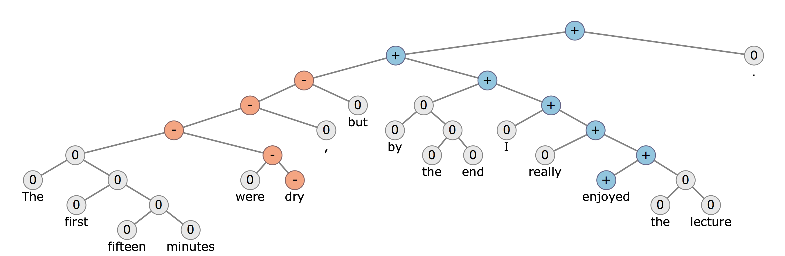

## Parse Tree

Rooted tree that represents the syntactic structure of a string according to some context-free grammar.

Tow types of parse tree

- Constituency based
- Dependency based

### Where is Parse Tree used in NLP

Sentiment analysis - By using a parse tree, you divide your sentence into parts [1]. Suppose, in the example of sentiment analysis, you can use those parts to assign a positive/negative sentiment to each part and then take the cumulative effect of those parts.

**Example Sentence**: The first fifteen minutes were dry but by the end I really enjoyed the lecture.

As referred in [1]:

>As for using them, you can simply generate a word vector representation of the individual words in the sentence and use neurons in place of the parent nodes. Each neuron should be connected to another neuron through weights. All the leaf nodes will be the word vector representations of words of the sentence. The top parent neuron(in this case the top blue + symbol) should generate a positive/negative sentiment according to the sentence. This tree structure can be trained in a supervised manner.

Also as mentioned in [2], the Tree-LSTM structure is used in predicting the semantic relatedness of two sentences (SemEval 2014, Task 1) and sentiment classification (Stanford Sentiment Treebank).

Reference:
1. https://datascience.stackexchange.com/questions/1034/what-features-are-generally-used-from-parse-trees-in-classification-process-in-n

2. Tree-LSTM https://arxiv.org/abs/1503.00075
3. https://www.quora.com/What-is-a-parse-tree-in-nlp-and-for-what-is-it-used
