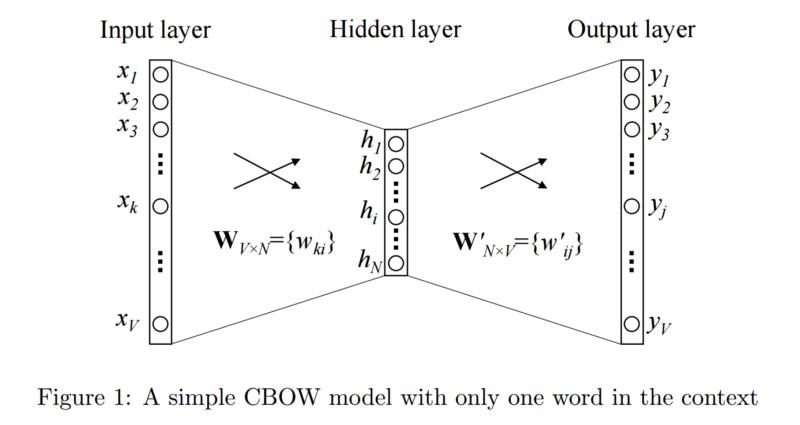

# Word Embedding

We need to represent words in numbers before we can apply Machine Learning algorithms
for language processing. In Machine Learning, these are called **Word Vectors**.

One way to generate Word Vectors is to use count based methods. **Count Vectors** - as
we call it is a one-hot encoded representation of words. But one-hot encoded
representations are very sparse - only one 1 and rest of the vectors are filled with 0.
Also, these count vectors based representations do not offer much insight on the context
which is a holy grail in NLP.

Another way of generating **Word Vectors** is - **Neural Word Embedding** which is what this topic is about

To summarize - **Word Embedding** is a  
- Dense representation
- Distributed representation/vector - meaning each element represents a property, and they are shared between the words. For example: suppose we are representing animals based on 3
properties - furry, dangerous, mammals. Now if we want to categorize animals
(e.g. bears, cats, dogs, frogs etc.) based on those 3 properties, each property will
have some number in the range of 0-1 depending on how representative those animals
are wrt. those properties. For example - bear can be furry = 0.9, dangerous = 0.85,
mammals = 1.0 etc.
- This distributed representation essentially groups similar things closer.
Mathematically, the cosine of the angle between such vectors should be close to
1, i.e. angle close to 0.
- So we can infer some information about words based on their vectors. We don't
even need any label. That's AMAZING!
- Shallow Neural Network (only one hidden layer) - more on this later.

### How do we create these word embeddings?

There are 2 common Word Embedding models - Word2Vec and GloVe

Then again, Word2Vec is 2 types
- Skip Gram and
- Continuous Bag Of Words (CBOW)

### Word2Vec
Word2Vec is a way to create word embeddings.

The Kaggle article[5] describes it well -

>Word2vec is a neural network implementation that learns distributed representations for words.
Word2Vec does not need labels in order to create meaningful representations. This is useful, since most data in the real world is unlabeled. If the network is given enough training data (tens of billions of words), it produces word vectors with intriguing characteristics. Words with similar meanings appear in clusters, and clusters are spaced such that some word relationships, such as analogies, can be reproduced using vector math. The famous example is that, with highly trained word vectors, "king - man + woman = queen."

**CBOW Model**:
- Predict the current word, based on the surrounding words. In most cases, this
is just predicting 1 word based on the 1 closest word.

**Example sentence**: Have a great day

Suppose out input is **great** and we want to predict the next word **day**. we use the one hot encoding of the input word and measure the output error compared to one hot encoding of the target word (day). **In the process of predicting the target word, we learn the vector representation of the target word** [4].

The input is a one hot encoded vector of size V. The hidden layer contains N neurons and the output is a V length vector with the elements being the Softmax values. The hidden layer neurons just copy the weighted sum of inputs to the next layer. There is no activation function in the hidden layer. The only non-linearity is the Softmax calculations in the output layer.

_Figure 2: CBOW based on multiple context words_

**Skip Gram Model**:
- Predict the surrounding words, based on the current word. Skip-gram uses the centre word to predict the surrounding words.

_Figure 3: Skip-Gram Model_

### What are these weight matrics?

First - Word2Vec **trainable model** and **runtime model** are different.

Trainable model has 2 matrices - one on the input side another in the output side. The output side W matrix makes sure the input side W is correct, by using backpropagation technique. Once you have the trainable model ready,  you don't need the output side W matrix anymore during runtime. During runtime, as mentioned in the stackexchange[6] article -

>you would just grab the appropriate column (or row, depending on your preferred notation) from that matrix, during Runtime. The benefit is that this way you get a very cheaply pre-trained fully-connected layer, designed to work with one-hots

**Now lets talk about the Word2Vec training model**

During training of Word Embedding - we need 2 matrices. One from input one-hot to hidden layer
and another from hidden layer to output one-hot layer. During the runtime you throw away the second matrix. But don't delete it permanently in case if you need to come back and continue training your model. The stackexchange article [6] describes the weight matrices the best.

"
>A typical Word2Vec train-able model consists of 1 input layer (for example, 10 000 long one-hot vector), a hidden layer (for example 300 neurons), an output (10 000 long one-hot vector)
>
>- Input: 10000
>- Hidden: 300
>- Output: 10000
>
>There is a matrix **E** between Input-Hidden, describing the weights to make your one-hot into an embedding. The matrix is special because each column (or rows, depending on your preferred notation) represents pre-activations in those 300 neurons - a response to a corresponding incoming 1-hot vector.
>
>**You don't need to perform any activation on these 300 neurons and can use their values straight away as an embedding in any future task.**

>
>However, simply squeezing a one-hot into a 300-dimensional representation isn't enough - it must have a meaning. And we ensure this meaning is correct using an additional **second matrix** - which connects Hidden to Output
>
>We don't want to activate a hidden layer **because activation-function won't be needed during runtime**, however, in that case we will need a second matrix, going from Hidden to Output.
>
>This second matrix will make an entirely different one-hot from your embedding. Such a one-hot will represent a most likely word to be nearby (contextually) of your original one-hot. In other words, this output won't be your original one-hot.
>
>That's why a second matrix is needed. At the output, we perform a softmax, like in a classification problem.
>
>This allows us to express a relation "word"-->embedding-->"context-neighbor-word"
>
>Now, backpropagation can be done, to correct the Input-Hidden weights (Your first matrix E) - these are the weights we really care about. That's because Matrix E can be used during Runtime (I think), perhaps being plugged as a first fully-connected layer into some Recurrent Neural Net.

"
### Why activation function is not needed during runtime at Word2Vec?
https://datascience.stackexchange.com/questions/43447/why-activation-function-is-not-needed-during-the-runtime-of-an-word2vec-model

### How do you initialize weight matrix W, W'?
You can use pre-trained Word2Vec model weight matrix as the initializer or random initialization (more common in practice) [7].

### When to use pre-trained Word Embedding or not?

### What are the issues with Word2Vec?
For details, check out the reference [9]

- Inability to handle unknown or OOV words
- No shared representations at sub-word levels
- Scaling to new languages requires new embedding matrices
- Cannot be used to initialize state-of-the-art architectures. **If you have a model that takes character-based input, you normally can’t leverage the benefits of pre-training, which forces you to randomize embeddings.**

### Word2Vec vs GloVe
**Word2Vec** - prediction based - NN model
**GloVe** is count based - Count-based models learn their vectors by essentially doing dimensionality reduction on the co-occurrence counts matrix.
**Count matrix** - large matrix of (words x context) co-occurrence information, i.e. for each "word" (the rows), you count how frequently we see this word in some "context" (the columns) in a large corpus. The number of context is very large so they factorize the matrix to smaller ones…. In the specific case of GloVe, the counts matrix is preprocessed by normalizing the counts and log-smoothing them.
https://medium.com/deeper-learning/glossary-of-deep-learning-word-embedding-f90c3cec34ca
https://www.kaggle.com/c/word2vec-nlp-tutorial#part-2-word-vectors  
https://www.quora.com/How-is-GloVe-different-from-word2vec

### How to make these models computationally more efficient

Hierarchical Softmax and Skip-Gram Negative Sampling are used. For details - refer the original paper and slide#7 here https://docs.google.com/file/d/0B7XkCwpI5KDYRWRnd1RzWXQ2TWc/edit

- Hierarchical Softmax: Representing Softmax as binary tree. So runtime improves from O(V) to O(log2V) 

## Reference:
1. Google code https://code.google.com/archive/p/word2vec/
2. Original NIPS 2013 presentation https://docs.google.com/file/d/0B7XkCwpI5KDYRWRnd1RzWXQ2TWc/edit
3. http://www.marekrei.com/pub/Constructing_and_Evaluating_Word_Embeddings.pdf
4. https://towardsdatascience.com/introduction-to-word-embedding-and-word2vec-652d0c2060fa
5. https://www.kaggle.com/c/word2vec-nlp-tutorial#part-2-word-vectors
6. Best description of why we need the weight matrix https://datascience.stackexchange.com/questions/29019/why-do-we-need-2-matrices-for-word2vec-or-glove
7. Word Embedding Initialization https://arxiv.org/pdf/1711.09160.pdf
8. DNN Weight Initialization https://datascience.stackexchange.com/questions/10926/how-to-deep-neural-network-weight-initialization
9. Challenges of Word2Vec http://blog.aylien.com/word-embeddings-and-their-challenges/
10. Sebastian Ruder - On Ward Embedding http://ruder.io/word-embeddings-1/index.html
11. Good blog referring to FastText etc. https://towardsdatascience.com/word-embeddings-exploration-explanation-and-exploitation-with-code-in-python-5dac99d5d795
